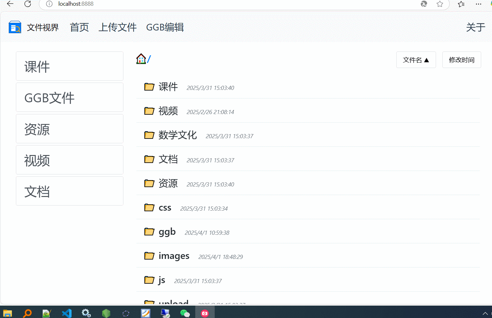

<div style="text-align: center; margin-bottom: 20px;">
    <button onclick="toggleLanguage('cn')">中文</button>
    <a href="./readme.en.md"><button>English</button></a>
    <a href="./doc/dev.md"><button>Developer Docs</button></a>
</div>

# GeoGebra Classroom Presentation Solution

## Project Background

As a mathematics teacher, I frequently need to demonstrate dynamic plane and solid geometry figures in class while integrating various teaching resources. The traditional approach requires carrying a USB drive and manually running GeoGebra software, which is quite cumbersome. To simplify this process, I developed the FileVue project, leveraging GeoGebra's web display functionality to support local file resource presentation, enabling teachers to directly access required resources through a web browser, significantly improving teaching efficiency.

## Features
### Core Features
- Server sends file directories to client
- Client (browser) implements recursive file directory display
- Supports custom web display methods for various file types

### Technology Comparison
| Feature      | Cache & Compression | File Upload | Lightweight |
|:-----------:|:------------------:|:-----------:|:-----------:|
| Everything  | No                 | No          | Yes         |
| Nginx       | Yes                | No          | Yes         |
| MinIO       | Yes                | Yes         | No          |
| This Project| Yes                | Yes         | Yes         |

### Advantages
1. 🧩 **Frontend-Backend Separation**: Backend can flexibly use various programming languages and frameworks to recursively send file directories; Frontend handled by `fileVue.js`, no additional dependencies required
2. 📦 **Packaged Library**: `fileVue.js` uses library packaging to ensure independent runtime environment
3. 🎨 **Non-intrusive Design**: Frontend supports custom handling for any file extensions including `.ggb`
4. ⚡ **Performance Optimization**: Backend supports caching and file compression, significantly improving access speed with fast `.ggb` file response
5. 🛠️ **Flexible Configuration**: Supports both frontend and backend configuration to meet personalized needs

## Quick Start
### Core Files
- `FileVue.exe`: Main program file
- `public` folder: Frontend resource files
- `config.js`: Configuration file

### Open Source Repositories
Project is open source, contributions welcome:
1. [Gitee](https://gitee.com/wangwangqin523/file-vue.git)
2. [Github](https://github.com/yunend/filevue.git)

### Demo
<figure>
    
    <figcaption>Figure 1: FileVue Demo Animation</figcaption>
</figure>

## Project Structure
<figure>
    
    <figcaption>Figure 2: Project Flowchart</figcaption>
</figure>

<figure>
    
    <figcaption>Figure 3: filevue.js Sequence Diagram</figcaption>
</figure>

### Installation
1. Native Windows Installation:
   - Download zip package: [fileVue-win-x64.zip](https://gitee.com/wangwangqin523/file-vue/raw/master/fileVue-win-x64.zip)
   - Place `FileVue.exe`, `config.js` and `public` folder in the same directory
   - Double-click to run `FileVue.exe`
   - Open browser and visit `http://localhost:8888`

2. Docker Installation:
```bash
# Pull latest image
docker pull ghcr.io/yunend/filevue:latest

# Run container (Windows/Linux compatible)
docker run --name fv --net=host \
  -v /path/to/your/public:/app/public \
  --entrypoint /bin/sh \
  ghcr.io/yunend/filevue:latest \
  -c "cp -r /app/public-bak/* /app/public/ && exec node server.js"
 ```bash
  Parameters:
--net=host: Use host network mode
-v /path/to/your/public:/app/public: Mount local directory as static resource directory
Default port: 8888 (can be customized via config.js)
```

**Simply save files to the mounted directory to access them directly via browser through LAN or internet**
### Configuration
[Developer Documentation](./doc/dev.md)
## Online Demo
Visit our demo site: [https://geomath.icu:8080](https://geomath.icu:8080)

## Notes:
**1. Ensure the port is available when running fileVue.exe.**
**2. fileVue.exe uses compression middleware, so downloaded file size may show as unknown, but this doesn't affect the download.**