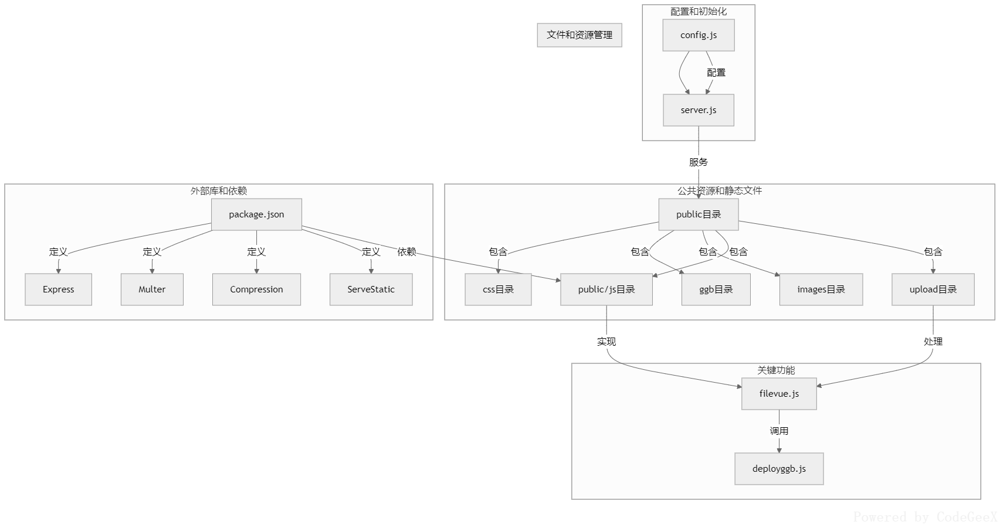
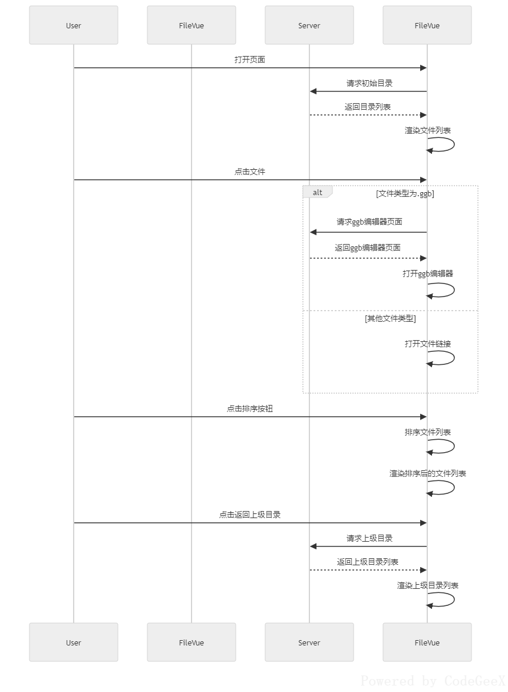

<div style="text-align: center; margin-bottom: 20px;">
    <button onclick="toggleLanguage('cn')">中文</button>
    <a href="./readme.en.md"><button>English</button></a>
</div>


# GeoGebra 课堂演示新方案

## 项目背景

作为一名数学教师，我经常需要在课堂上展示动态的平面与立体几何图形，并整合各类教学资源。传统方式需要携带U盘并手动运行GeoGebra软件，流程较为繁琐。为简化操作，我开发了FileVue项目，利用GeoGebra的网页展示功能，支持本地文件资源展示，使教师可通过网页直接访问所需资源，显著提升教学效率。
## 功能特性
### 核心功能
- 服务器向客户端发送文件目录
- 客户端（浏览器）通过递归实现文件目录展示
- 支持自定义各类文件类型的网页展示方式
### 技术对比
| 特性         | 缓存与压缩 | 文件上传 | 轻量级 |
|:------------:|:----------:|:--------:|:------:|
| Everything   | 否         | 否       | 是     |
| Nginx        | 是         | 否       | 是     |
| MinIO        | 是         | 是       | 否     |
| 本项目       | 是         | 是       | 是     |
### 项目优势
1. 🧩 **前后端分离**：后端可灵活切换编程语言与框架，递归实现文件目录发送；前端由`fileVue.js`处理，无需额外依赖
2. 📦 **封装打包**：`fileVue.js`采用库打包，确保运行环境独立
3. 🎨 **无侵入式设计**：前端支持包括`.ggb`在内的任意后缀名文件自定义处理
4. ⚡ **性能优化**：后端支持缓存与文件压缩，显著提升访问速度，`.ggb`文件响应迅速
5. 🛠️ **灵活配置**：支持前后端配置，满足个性化需求
## 快速开始
### 核心文件
- `FileVue.exe`：主程序文件
- `public` 文件夹：前端资源文件
- `config.js`：配置文件
### 开源地址
项目已开源，欢迎贡献代码：
1. [Gitee](https://gitee.com/wangwangqin523/file-vue.git)
2. [Github](https://github.com/yunend/filevue.git)

### 效果展示
<figure>
    
    <figcaption>图1：FileVue 演示动画</figcaption>
</figure>

## 项目结构
<figure>
    
    <figcaption>图2：项目流程图</figcaption>
</figure>

<figure>
    
    <figcaption>图3：filevue.js 时序图</figcaption>
</figure>

### 安装步骤
1. windows系统下，下载压缩包：[fileVue-win-x64.zip](https://gitee.com/wangwangqin523/file-vue/raw/master/fileVue-win-x64.zip)
2. 将 `FileVue.exe`、`config.js` 文件与 `public` 文件夹放置在同一目录下
3. 双击运行 `FileVue.exe`
4. 打开浏览器，访问 `http://localhost:8888`

**以后，只需将本地文件保存至 `public` 文件夹，即可通过局域网或互联网在浏览器中直接访问**
### 配置说明
#### 服务端配置
修改`config.js`文件，支持自定义参数。例如：可将`public`文件夹重命名或移动至其他目录，需相应修改`staticFolder`参数。若不修改则使用默认配置。
```javascript
module.exports = {
    port: 8888,         // 服务器监听端口
    enableUpload: true, // 是否启用文件上传功能
    staticFolder: 'D:/public2' // 静态资源文件夹路径，必须使用正斜杠，不能使用反斜杠
};
```
#### 客户端配置

在html文件中引入fileVue.js与fileVue.css，以及fileListContainer
```html
<head>
    <link rel="stylesheet" href="/css/fileVue.css">
</head>
<body>
    <div id="fileListContainer"></div>
    <script src="/js/fileVue.js"></script>
</body>
```
如果不配置，则使用默认配置；如需要配置则增加以下代码
```html
<script >
window.addEventListener("DOMContentLoaded", function () {
    fileVue.setConfig({
        showHeader: true,    // 是否显示文件列表头
        showDate: true,      // 是否显示文件日期
        showDownload: true,  // 是否显示下载链接
        initialPath: '/'     // 初始化加载目录
    });

    // 自定义文件类型处理
    
    fileVue.handleFileClick = function (item) {
//item的结构如下：{name: 'css', type: 'directory', path: '/css', mtime: '2025-03-31T07:03:34.995Z'}，{name: 'upload.html', type: 'file', path: '/upload.html', mtime: '2025-02-24T11:12:22.265Z'}

        const extension = item.name.split('.').pop().toLowerCase();
        switch (extension) {
            case 'ggb':
                window.open(`/ggb/ggb-editor.html?path=${encodeURIComponent(item.path)}`, '_ggb');
                break;
            default:
                window.open(`${item.path}`, '_blank');
        }
    }
});
</script>
```
## 在线演示
访问我们的在线演示站点：[https://geomath.icu:8080](https://geomath.icu:8080)

## 注：
**1. 运行fileVue.exe时，确保使用的端口未被占用。**

**2. fileVue.exe由于使用 compression 中间件对文件进行了压缩，所以下载文件时显示大小未知，但并不影响下载**